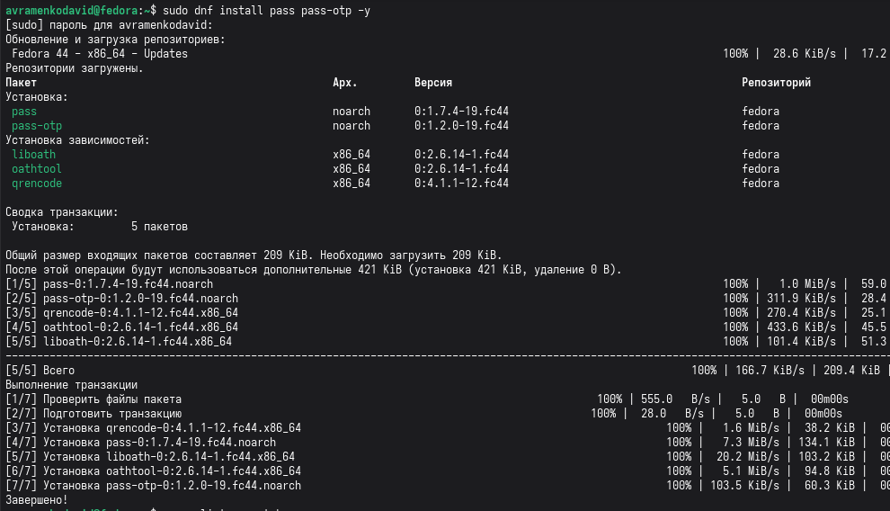
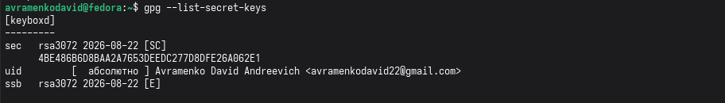
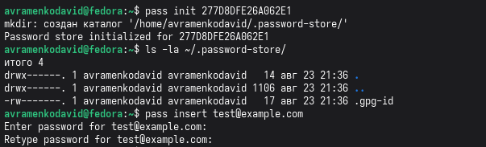
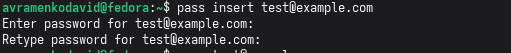
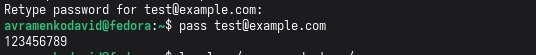
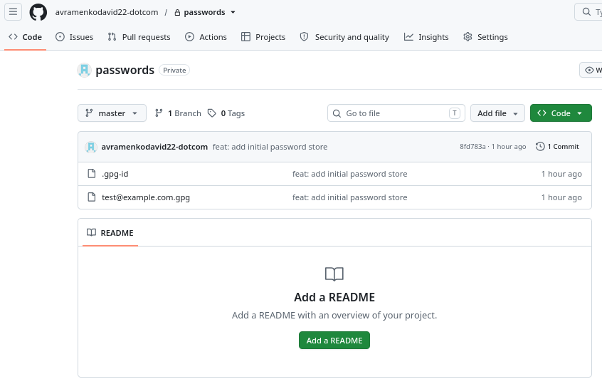
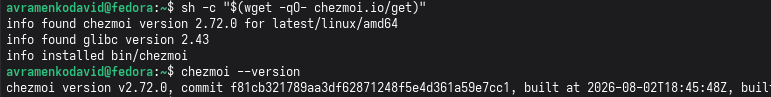
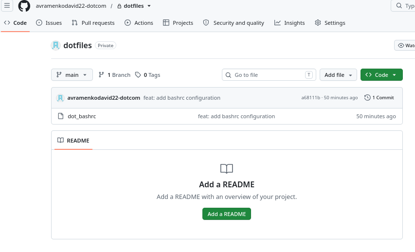
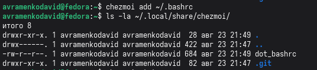
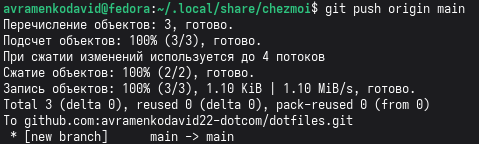

# Лабораторная работа №5
## Менеджер паролей pass и управление файлами конфигурации

### 1. Цель работы
Получение навыков работы с менеджером паролей `pass` и инструментом управления файлами конфигурации `chezmoi`.

### 2. Задание
1. Установить менеджер паролей `pass`.
2. Инициализировать хранилище паролей с использованием GPG-ключа.
3. Добавить тестовый пароль.
4. Создать закрытый репозиторий на GitHub для хранения паролей.
5. Установить `chezmoi` для управления конфигурационными файлами.
6. Создать репозиторий `dotfiles` на GitHub.
7. Добавить файл `.bashrc` в управление `chezmoi`.

### 3. Выполнение лабораторной работы

#### 3.1. Установка менеджера паролей pass
Был установлен менеджер паролей `pass` с помощью команды `sudo dnf install pass pass-otp -y`.

#### 3.2. Проверка GPG-ключей
Был проверен список GPG-ключей командой `gpg --list-secret-keys`. Был найден ключ с ID `277D8DFE26A062E1`.

#### 3.3. Инициализация хранилища паролей
Хранилище было инициализировано командой `pass init 277D8DFE26A062E1`. Была создана папка `~/.password-store/`.

#### 3.4. Добавление пароля
Был добавлен тестовый пароль для `test@example.com` командой `pass insert test@example.com`.

#### 3.5. Проверка сохранения пароля
Был проверен сохранённый пароль командой `pass test@example.com`.

#### 3.6. Создание репозитория для паролей на GitHub
Был создан **закрытый** репозиторий `passwords` на GitHub. Пароли были отправлены в этот репозиторий.

#### 3.7. Установка chezmoi
Был установлен `chezmoi` с помощью команды `sh -c "$(wget -qO- chezmoi.io/get)"`. Проверена версия `chezmoi --version`.

#### 3.8. Создание репозитория для dotfiles на GitHub
Был создан **закрытый** репозиторий `dotfiles` на GitHub.

#### 3.9. Инициализация chezmoi
Был выполнен `chezmoi init git@github.com:avramenkodavid22-dotcom/dotfiles.git`.

#### 3.10. Добавление файла конфигурации в chezmoi
Файл `.bashrc` был добавлен в управление `chezmoi` командой `chezmoi add ~/.bashrc`. В папке `~/.local/share/chezmoi/` появился файл `dot_bashrc`.

#### 3.11. Отправка dotfiles на GitHub
Файлы были отправлены в репозиторий `dotfiles` на GitHub.

### 4. Выводы
В ходе выполнения лабораторной работы были освоены инструменты для безопасного хранения паролей (`pass`) и управления конфигурационными файлами (`chezmoi`). Созданы закрытые репозитории на GitHub для синхронизации этих данных между разными компьютерами. Полученные навыки позволяют организовать безопасную и удобную работу с паролями и настройками системы.

### 5. Список литературы
1. Документация pass: https://www.passwordstore.org/
2. Документация chezmoi: https://www.chezmoi.io/
